# 🧠 Authentication & Initialization Flow (Angular App)

## 🔹 Overview

This diagram explains how the authentication, token handling, and menu loading flow works in our Angular application.  
It covers:

- `APP_INITIALIZER` boot process
- `AuthService`, `TokenService`, `MenuService` relations
- How `AuthInterceptor` and `TokenRefreshService` cooperate safely (without circular dependency)

---

## 🔹 System Flow

```mermaid
flowchart TD

    %% ---------- APP INITIALIZER ----------
    subgraph A["APP_INITIALIZER (Run on App Start)"]
        A1["Check existing session (AuthService.restoreSession)"]
        A2["If valid → Load Menu (MenuService.loadMenu)"]
        A3["If invalid → Redirect to /login"]
    end

    %% ---------- AUTH SERVICE ----------
    subgraph B["AuthService"]
        B1["login() → call /auth/login"]
        B2["logout() → clear tokens + menu cache"]
        B3["restoreSession() → check token validity"]
        B4["(use TokenService to get/set tokens)"]
    end

    %% ---------- TOKEN SERVICE ----------
    subgraph C["TokenService"]
        C1["getAccessToken() / getRefreshToken()"]
        C2["setTokens(access, refresh)"]
        C3["clearTokens()"]
        C4["Store in localStorage (Single Source of Truth)"]
    end

    %% ---------- TOKEN REFRESH SERVICE ----------
    subgraph D["TokenRefreshService"]
        D1["refreshToken() → call /auth/refresh"]
        D2["Handle 'refreshInProgress' flag"]
        D3["Update TokenService on success"]
    end

    %% ---------- MENU SERVICE ----------
    subgraph E["MenuService"]
        E1["loadMenu() → from cache or API"]
        E2["setMenu() → menusSubject.next(menu)"]
        E3["clearMenuCache()"]
        E4["Store menu in localStorage (cache)"]
    end

    %% ---------- INTERCEPTOR ----------
    subgraph F["AuthInterceptor"]
        F1["Intercept outgoing requests"]
        F2["Skip URLs: /auth/login, /auth/refresh"]
        F3["Add Authorization header from TokenService"]
        F4["On 401 → call TokenRefreshService.refreshToken()"]
        F5["Retry original request after refresh"]
    end

    %% ---------- RELATIONSHIPS ----------
    A1 -->|use| B3
    A2 -->|use| E1
    B1 -->|store token in| C2
    B3 -->|read from| C1
    D1 -->|on success →| C2
    E1 -->|cache →| E4
    F3 -->|read token from| C1
    F4 -->|trigger| D1
    B2 -->|clear all| C3 & E3
```

